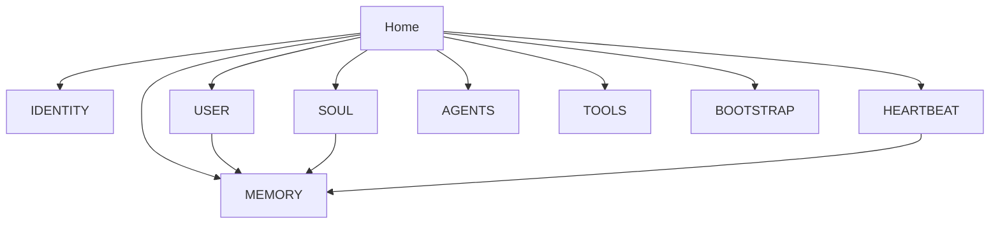

# File Map

```mermaid
graph TD
  HOME[Home]
  ID[IDENTITY]
  USER[USER]
  MEM[MEMORY]
  HB[HEARTBEAT]
  SOUL[SOUL]
  AG[AGENTS]
  TOOLS[TOOLS]
  BOOT[BOOTSTRAP]

  HOME --> ID
  HOME --> USER
  HOME --> MEM
  HOME --> HB
  HOME --> SOUL
  HOME --> AG
  HOME --> TOOLS
  HOME --> BOOT

  USER --> MEM
  SOUL --> MEM
  HB --> MEM
```
