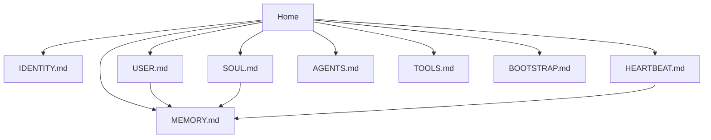

# File Map

```mermaid
graph TD
  H[Home]
  I[IDENTITY.md]
  U[USER.md]
  M[MEMORY.md]
  HB[HEARTBEAT.md]
  S[SOUL.md]
  A[AGENTS.md]
  T[TOOLS.md]
  B[BOOTSTRAP.md]

  H --> I
  H --> U
  H --> M
  H --> HB
  H --> S
  H --> A
  H --> T
  H --> B

  U --> M
  S --> M
  HB --> M
```

> This is conceptual (for orientation), not an execution graph.
